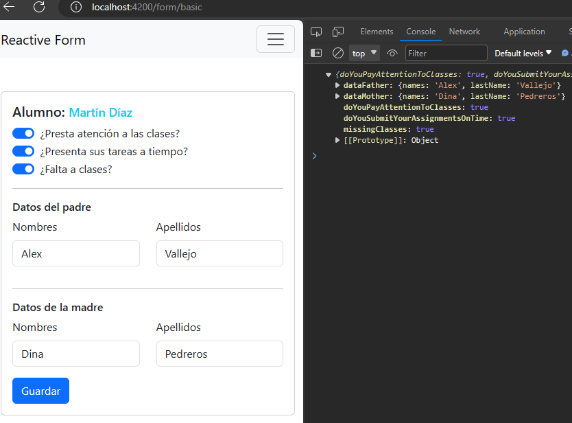
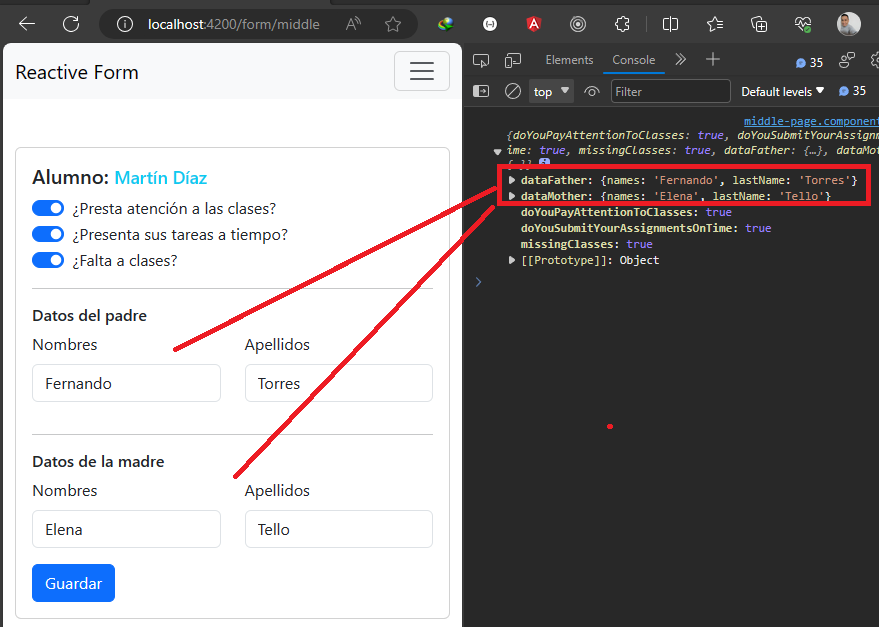
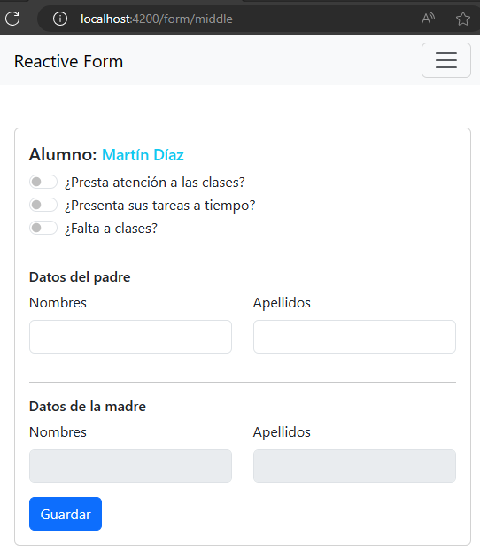

# Formularios Reactivos

This project was generated with [Angular CLI](https://github.com/angular/angular-cli) version 16.2.1.

---

## [Control Container, Reusable Reactive Form](https://www.youtube.com/watch?v=AWWq1DHsHfI)

En este tutorial veremos formas complejas de trabajar con formularios reactivos.

## Formulario Básico

A continuación se muestra la construcción de un `Reactive Form` usando el `ReactiveFormsModule`. Para eso 
nos apoyamos del `FormBuilder`:

````typescript
@Component({
  selector: 'app-basic-page',
  standalone: true,
  imports: [ReactiveFormsModule],
  templateUrl: './basic-page.component.html',
  styles: [
  ]
})
export class BasicPageComponent {

  private _fb = inject(FormBuilder);

  public form: FormGroup = this._fb.group({
    doYouPayAttentionToClasses: [false],
    doYouSubmitYourAssignmentsOnTime: [false],
    missingClasses: [false],
    dataFather: this._fb.group({
      names: ['', [Validators.required]],
      lastName: ['', [Validators.required]],
    }),
    dataMother: this._fb.group({
      names: ['', [Validators.required]],
      lastName: ['', [Validators.required]],
    }),
  });

  public saveData(): void {
    console.log(this.form.value);
  }
}
````

El componente `html` simplificado sería de la siguiente manera:

````html
<form [formGroup]="form" (ngSubmit)="saveData()">
  <input class="form-check-input" type="checkbox" role="switch" id="flexSwitchCheckChecked1"
    formControlName="doYouPayAttentionToClasses">
  <label class="form-check-label" for="flexSwitchCheckChecked1">¿Presta atención a las clases?</label>
  <input class="form-check-input" type="checkbox" role="switch" id="flexSwitchCheckChecked2"
    formControlName="doYouSubmitYourAssignmentsOnTime">
  <label class="form-check-label" for="flexSwitchCheckChecked2">¿Presenta sus tareas a tiempo?</label>
  <input class="form-check-input" type="checkbox" role="switch" id="flexSwitchCheckChecked3"
    formControlName="missingClasses">
  <label class="form-check-label" for="flexSwitchCheckChecked3">¿Falta a clases?</label>
  <div class="form-check form-switch">
    <h6>Datos del padre</h6>
  </div>
  <div class="row father-data" formGroupName="dataFather">
    <label for="name-father" class="form-label">Nombres</label>
    <input type="text" class="form-control" id="name-father" formControlName="names">
    <label for="lastname-father" class="form-label">Apellidos</label>
    <input type="text" class="form-control" id="lastname-father" formControlName="lastName">
  </div>

  <h6>Datos de la madre</h6>

  <div class="row mother-data" formGroupName="dataMother">
    <label for="name-mother" class="form-label">Nombres</label>
    <input type="text" class="form-control" id="name-mother" formControlName="names">
    <label for="lastname-mother" class="form-label">Apellidos</label>
    <input type="text" class="form-control" id="lastname-mother" formControlName="lastName">
  </div>

  <button type="submit" class="btn btn-primary">Guardar</button>
</form>
````

Finalmente, tendremos la siguiente interfaz gráfica. Además probaremos su funcionamiento, cuando damos click en `Guardar` vemos que se están tomando todos los datos correctamente.



Ahora se nos presenta el siguiente caso:

### CASO

El bloque de los datos del padre y la madre se están repitiendo, además, vamos a usar ese bloque `nombres y apellidos` en más de un formulario. 

**¿Qué hacer?** reutilizar.  
**¿Cómo?** en componentes.

Bien, entonces se llega a la solución de que debemos crear un componente que albergue estos dos campos y luego poder reutilizar el componente en donde se requiera. **Todo bien hasta ese punto, pero ahora todo el formulario, incluyendo el bloque que se reutilizó, debe ser manejado por el formulario reactivo.**

> **¿Qué haces para que un componente o elemento nativo de html sea compatible con los Reactive Forms?**

Usar la interfaz `ControlValueAccessor`.

El `ControlValueAccessor` define una interfaz que actúa como puente entre la `API de formularios de Angular` y un `elemento nativo del DOM`. Implementa esta interfaz para crear una directiva de control de formularios personalizada que se integre con los formularios de Angular.

## Formulario Middle - Con ControlValueAccessor

Vamos a crear un componente llamado `PersonDataComponent` que tendrá los campos `names` y `lastName` que reutilizaremos en diversos formularios.

````typescript
@Component({
  selector: 'app-person-data',
  standalone: true,
  imports: [ReactiveFormsModule],
  templateUrl: './person-data.component.html',
  styles: [
  ]
})
export class PersonDataComponent {

  @Input({ required: true })
  public title: string = '';
  private _formBuilder = inject(NonNullableFormBuilder);

  public form: FormGroup = this._formBuilder.group({
    names: ['', [Validators.required]],
    lastName: ['', [Validators.required]]
  });

}
````
**DONDE**
- `NonNullableFormBuilder`, es similar a `FormBuilder`, pero los elementos FormControl construidos automáticamente tienen `{nonNullable: true}` y son no-nullables. Es decir, esto hará que los controles se restablezcan a su valor inicial, en lugar de null:

````html
<h6>{{ title }}</h6>
<div class="row father-data" [formGroup]="form">
  <div class="col-6">
    <div class="mb-3">
      <label for="name-father" class="form-label">Nombres</label>
      <input type="text" class="form-control" id="name-father" formControlName="names">
    </div>
  </div>
  <div class="col-6">
    <div class="mb-3">
      <label for="lastname-father" class="form-label">Apellidos</label>
      <input type="text" class="form-control" id="lastname-father" formControlName="lastName">
    </div>
  </div>
</div>
````

Ahora, debemos reutilizar este componente en nuestro formulario principal.

 `Nota:` En este punto, pasamos todo el formulario del `BasicPage` al `MiddlePage`, así que estaremos trabajando con este último formulario en esta sección.

El componente de `Typescript` sigue siendo el mismo que del formulario `BasicPage`. Mientras que el componente `html` sí cambió, ya que ahora estaremos usando el nuevo componente creado:

````html
<h5 class="card-title">Alumno: <small class="text-info">Martín Díaz</small></h5>
<form [formGroup]="form" (ngSubmit)="saveData()">
  <div class="section-check">
    <div class="form-check form-switch">
      <input class="form-check-input" type="checkbox" role="switch" id="flexSwitchCheckChecked1"
        formControlName="doYouPayAttentionToClasses">
      <label class="form-check-label" for="flexSwitchCheckChecked1">¿Presta atención a las clases?</label>
    </div>
    <div class="form-check form-switch">
      <input class="form-check-input" type="checkbox" role="switch" id="flexSwitchCheckChecked2"
        formControlName="doYouSubmitYourAssignmentsOnTime">
      <label class="form-check-label" for="flexSwitchCheckChecked2">¿Presenta sus tareas a tiempo?</label>
    </div>
    <div class="form-check form-switch">
      <input class="form-check-input" type="checkbox" role="switch" id="flexSwitchCheckChecked3"
        formControlName="missingClasses">
      <label class="form-check-label" for="flexSwitchCheckChecked3">¿Falta a clases?</label>
    </div>
  </div>
  <hr>
  <div class="section-parents">
    <!-- Reutilizando componente -->
    <app-person-data title="Datos del padre"/>
    <hr>
    <!-- Reutilizando componente -->
    <app-person-data title="Datos de la madre"/>
  </div>
  <div class="col-auto">
    <button type="submit" class="btn btn-primary">Guardar</button>
  </div>
</form>
````

Listo, veamos cómo queda el formulario con el nuevo componente agregado y además realicemos una prueba para ver su funcionamiento. Observamos que se sigue viendo como el formulario inicial. Ahora veamos llenemos algunos datos y veamos cómo se comporta cuando le damos en `Guardar`:


Observamos que los campos correspondientes al componente `<app-person-data/>` no están tomando los valores que le definimos manualmente en el formulario, mientras que los otros campos como los `<input type="check">` sí están tomando sus valores con total normalidad. **¿Qué está pasando?**

Pues, necesitamos que el nuevo componente `<app-person-data></app-person-data>` sea reconocido por el fomulario y para eso necesitamos que dicho componente implemente la interfaz `ControlValueAccessor`.

### Implementando la interfaz ControlValueAccessor

Esta interfaz nos va a permitir que el formulario donde coloquemos el componente `PersonDataComponent` sea reconocido como parte del formulario. Para eso, necesitamos implementar los métodos de dicha interfaz: 
`writeValue(), registerOnChange(), registerOnTouched(), setDisabledState?()`.

Ahora, en esta sección vamos a tipar el formulario reactivo del componente `PersonDataComponent`, de esa forma seremos más declarativos con nuestro formulario, es decir, construiremos nuestro formulario en base a un modelo.

Recordemos que en un apartado más arriba ya habíamos construido el formulario, pero sin tipar. A continuación mostramos el cambio que le haremos con su tipado correspondiente:

Creamos un archivo llamado `person-data.model.ts` que tendrá la interfaz de nuestro formulario reactivo:

```typescript
import { FormControl } from "@angular/forms";

export interface IPersonDataForm {
  names: FormControl<string>;
  lastName: FormControl<string>;
}

export interface IPersonData {
  names: string;
  lastName: string;
}
```

Ahora usamos la interfaz anterior para tipar nuestro formulario:

```typescript
@Component({
  selector: 'app-person-data',
  standalone: true,
  imports: [ReactiveFormsModule],
  templateUrl: './person-data.component.html',
  styles: [],
  providers: [
    {
      provide: NG_VALUE_ACCESSOR,
      useExisting: forwardRef(() => PersonDataComponent),
      multi: true,
    },
  ],
})
export class PersonDataComponent implements ControlValueAccessor {

  private _formBuilder = inject(NonNullableFormBuilder);

  /* other attributes */

  public form: FormGroup = this._formBuilder.group<IPersonDataForm>({
    names: this._formBuilder.control('', { validators: [Validators.required] }),
    lastName: this._formBuilder.control('', { validators: [Validators.required] }),
  });

  // ControlValueAccessor --------------------------------------------------------
  writeValue(obj: IPersonData): void {
    if (obj) {
      this.form.setValue(obj);
    }
  }

  registerOnChange(fn: Function): void {
    this._onChanged = fn;
  }

  registerOnTouched(fn: Function): void {
    this._onTouch = fn;
  }

  setDisabledState(isDisabled: boolean): void {
    isDisabled ? this.form.disable() : this.form.enable();
  }
}
```

### Emitir errores hacia el formulario padre

El formulario anterior ya podría ser reconocido por algún formulario donde sea colocado, pero ahora viene otra pregunta: **¿Cómo hacemos para que nuestro formulario reutilizable emita los errores a su componente padre?**, bueno para eso necesitamos implementar la interfaz `Validator`.

Básicamente, el funcionamiento de la interfaz `Validator` es, cuando en este componente ocurra algún error de validación del formulario los errores se van a propagar al formulario que esté conteniendo este componente.

Veamos su implementación:


```typescript
@Component({
  selector: 'app-person-data',
  standalone: true,
  imports: [ReactiveFormsModule],
  templateUrl: './person-data.component.html',
  styles: [],
  providers: [
    {
      provide: NG_VALUE_ACCESSOR,
      useExisting: forwardRef(() => PersonDataComponent),
      multi: true,
    },
    {
      provide: NG_VALIDATORS,
      useExisting: forwardRef(() => PersonDataComponent),
      multi: true,
    }
  ],
})
export class PersonDataComponent implements ControlValueAccessor, Validator {

  private _formBuilder = inject(NonNullableFormBuilder);

  private _onChanged: Function = (_value: { names: string; lastName: string; }) => { };
  private _onTouch: Function = (_value: { names: string; lastName: string; }) => { };

  /* other properties */

  constructor() {
    this.form.valueChanges
      .subscribe(() => {
        const value = this.form.value;
        this._onChanged(value);
        this._onTouch(value);
      });
  }

  // ControlValueAccessor --------------------------------------------------------
  /* ControlValueAccessor methods */

  // Validator  ------------------------------------------------------------------
  validate(control: AbstractControl<any, any>): ValidationErrors | null {
    return this.form.valid ? null : { personData: true };
  }

  registerOnValidatorChange?(fn: () => void): void {
    this._onChanged = fn;
  }

}
```

### Reutilizando componente PersonDataComponent en formulario reactivo

Una vez terminado de desarrollar nuestro componente reutilizable que tiene un formulario con dos campos, ahora lo vamos a reutilizar en el formulario `MiddlePageComponent`.


Nuestro formulario principal quedaría así:

```html
<form [formGroup]="form" (ngSubmit)="saveData()">
  <div class="section-check">
    <div class="form-check form-switch">
      <input class="form-check-input" type="checkbox" role="switch" id="flexSwitchCheckChecked1"
        formControlName="doYouPayAttentionToClasses">
      <label class="form-check-label" for="flexSwitchCheckChecked1">¿Presta atención a las clases?</label>
    </div>
    <div class="form-check form-switch">
      <input class="form-check-input" type="checkbox" role="switch" id="flexSwitchCheckChecked2"
        formControlName="doYouSubmitYourAssignmentsOnTime">
      <label class="form-check-label" for="flexSwitchCheckChecked2">¿Presenta sus tareas a tiempo?</label>
    </div>
    <div class="form-check form-switch">
      <input class="form-check-input" type="checkbox" role="switch" id="flexSwitchCheckChecked3"
        formControlName="missingClasses">
      <label class="form-check-label" for="flexSwitchCheckChecked3">¿Falta a clases?</label>
    </div>
  </div>
  <hr>
  <div class="section-parents">
    <!-- Reutilizando componente <pp-person-data> -->
    <app-person-data title="Datos del padre" formControlName="dataFather"/>
    <hr>
    <!-- Reutilizando componente <pp-person-data> -->
    <app-person-data title="Datos de la madre" formControlName="dataMother"/>
  </div>
  <div class="col-auto">
    <button type="submit" class="btn btn-primary">Guardar</button>
  </div>
</form>
```
Observar que el componente que hemos desarrollado está siendo tratado como un elemento de fomulario nativo html, por lo que usamos el `formControlName` para especificar a qué campo hace referencia. 

Finalmente, el último cambio se realizará en el formulario padre del `MiddlePageComponent`. El componente que agregamos en el formulario reactivo lo trataremos como un campo del tipo `formControl`, por eso es que usamos el `formControlName` en el html y en su componente de typescript con la ayuda del `formBuilder` lo definiremos como un `control (formControl)`:

````typescript
@Component({
  selector: 'app-middle-page',
  standalone: true,
  imports: [ReactiveFormsModule, PersonDataComponent],
  templateUrl: './middle-page.component.html',
  styles: [
  ]
})
export class MiddlePageComponent {
  private _fb = inject(FormBuilder);

  public form: FormGroup = this._fb.group({
    doYouPayAttentionToClasses: [false],
    doYouSubmitYourAssignmentsOnTime: [false],
    missingClasses: [false],
    dataFather: this._fb.control(null, { validators: [Validators.required]}),
    dataMother: this._fb.control(null, { validators: [Validators.required]}),
  });

  public saveData(): void {
    console.log(this.form.value);
  }
}
````

Ejecutamos la aplicación y esta vez veremos que el formulario está reconociendo los campos del nuevo componente:



Como ahora el componente `PersonDataComponent` ya tiene implementado el `ControlValueAccessor` podemos tratar a ese componente como un elmento de formulario html nativo. En ese sentido, lo vamos a iniciar deshabilitado, para eso, necesitamos realizar lo siguiente:

````typescript
@Component({
  selector: 'app-middle-page',
  standalone: true,
  imports: [ReactiveFormsModule, PersonDataComponent],
  templateUrl: './middle-page.component.html',
  styles: [
  ]
})
export class MiddlePageComponent {
  /* other property */

  public form: FormGroup = this._fb.group({
    /*other propety*/
    dataMother: this._fb.control({ value: null, disabled: true }, { validators: [Validators.required] }),
  });

  /* other method */
}
````

Como observamos, estamos iniciando el campo `dataModher` deshabilitado, eso significa que ese objeto estaría llegando al método `setDisabledState()` del `ControlValueAccessor` y allí hacemos la comprobación y deshabilitación de los campos:

````typescript
// En el PersonDataComponent
//
setDisabledState(isDisabled: boolean): void {
  isDisabled ? this.form.disable() : this.form.enable();
}
````


