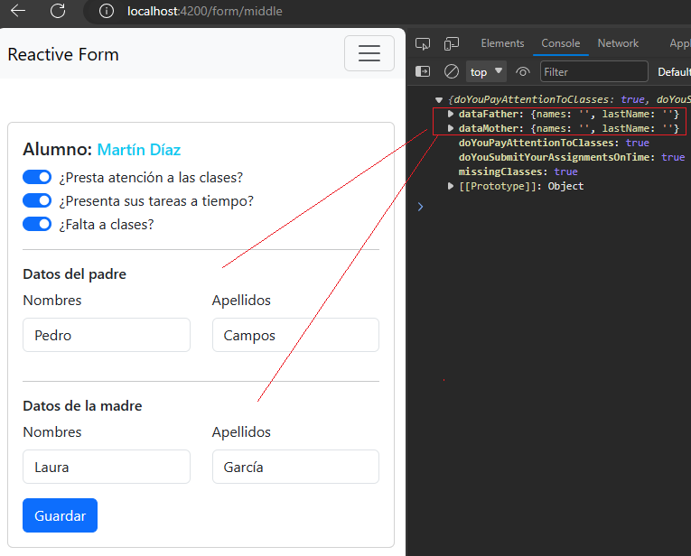

# Formularios Reactivos

This project was generated with [Angular CLI](https://github.com/angular/angular-cli) version 16.2.1.

---

## [Control Container, Reusable Reactive Form](https://www.youtube.com/watch?v=AWWq1DHsHfI)

En este tutorial veremos formas complejas de trabajar con formularios reactivos.

## Formulario Básico

A continuación se muestra la construcción de un `Reactive Form` usando el `ReactiveFormsModule`. Para eso 
nos apoyamos del `FormBuilder`:

````typescript
@Component({
  selector: 'app-basic-page',
  standalone: true,
  imports: [ReactiveFormsModule],
  templateUrl: './basic-page.component.html',
  styles: [
  ]
})
export class BasicPageComponent {

  private _fb = inject(FormBuilder);

  public form: FormGroup = this._fb.group({
    doYouPayAttentionToClasses: [false],
    doYouSubmitYourAssignmentsOnTime: [false],
    missingClasses: [false],
    dataFather: this._fb.group({
      names: ['', [Validators.required]],
      lastName: ['', [Validators.required]],
    }),
    dataMother: this._fb.group({
      names: ['', [Validators.required]],
      lastName: ['', [Validators.required]],
    }),
  });

  public saveData(): void {
    console.log(this.form.value);
  }
}
````

El componente `html` simplificado sería de la siguiente manera:

````html
<form [formGroup]="form" (ngSubmit)="saveData()">
  <input class="form-check-input" type="checkbox" role="switch" id="flexSwitchCheckChecked1"
    formControlName="doYouPayAttentionToClasses">
  <label class="form-check-label" for="flexSwitchCheckChecked1">¿Presta atención a las clases?</label>
  <input class="form-check-input" type="checkbox" role="switch" id="flexSwitchCheckChecked2"
    formControlName="doYouSubmitYourAssignmentsOnTime">
  <label class="form-check-label" for="flexSwitchCheckChecked2">¿Presenta sus tareas a tiempo?</label>
  <input class="form-check-input" type="checkbox" role="switch" id="flexSwitchCheckChecked3"
    formControlName="missingClasses">
  <label class="form-check-label" for="flexSwitchCheckChecked3">¿Falta a clases?</label>
  <div class="form-check form-switch">
    <h6>Datos del padre</h6>
  </div>
  <div class="row father-data" formGroupName="dataFather">
    <label for="name-father" class="form-label">Nombres</label>
    <input type="text" class="form-control" id="name-father" formControlName="names">
    <label for="lastname-father" class="form-label">Apellidos</label>
    <input type="text" class="form-control" id="lastname-father" formControlName="lastName">
  </div>

  <h6>Datos de la madre</h6>

  <div class="row mother-data" formGroupName="dataMother">
    <label for="name-mother" class="form-label">Nombres</label>
    <input type="text" class="form-control" id="name-mother" formControlName="names">
    <label for="lastname-mother" class="form-label">Apellidos</label>
    <input type="text" class="form-control" id="lastname-mother" formControlName="lastName">
  </div>

  <button type="submit" class="btn btn-primary">Guardar</button>
</form>
````

Finalmente, tendremos la siguiente interfaz gráfica. Además probaremos su funcionamiento, cuando damos click en `Guardar` vemos que se están tomando todos los datos correctamente.


Ahora se nos presenta el siguiente caso:

### CASO

El bloque de los datos del padre y la madre se están repitiendo, además, vamos a usar ese bloque `nombres y apellidos` en más de un formulario. 

**¿Qué hacer?** reutilizar.  
**¿Cómo?** en componentes.

Bien, entonces se llega a la solución de que debemos crear un componente que albergue estos dos campos y luego poder reutilizar el componente en donde se requiera. **Todo bien hasta ese punto, pero ahora todo el formulario, incluyendo el bloque que se reutilizó, debe ser manejado por el formulario reactivo.**

> **¿Qué haces para que un componente o elemento nativo de html sea compatible con los Reactive Forms?**

Usar la interfaz `ControlValueAccessor`.

El `ControlValueAccessor` define una interfaz que actúa como puente entre la `API de formularios de Angular` y un `elemento nativo del DOM`. Implementa esta interfaz para crear una directiva de control de formularios personalizada que se integre con los formularios de Angular.

## Formulario Middle - Con ControlValueAccessor

Vamos a crear un componente llamado `PersonDataComponent` que tendrá los campos `names` y `lastName` que reutilizaremos en diversos formularios.

````typescript
@Component({
  selector: 'app-person-data',
  standalone: true,
  imports: [ReactiveFormsModule],
  templateUrl: './person-data.component.html',
  styles: [
  ]
})
export class PersonDataComponent {

  @Input({ required: true })
  public title: string = '';
  private _formBuilder = inject(NonNullableFormBuilder);

  public form: FormGroup = this._formBuilder.group({
    names: ['', [Validators.required]],
    lastName: ['', [Validators.required]]
  });

}
````
**DONDE**
- `NonNullableFormBuilder`, es similar a `FormBuilder`, pero los elementos FormControl construidos automáticamente tienen `{nonNullable: true}` y son no-nullables. Es decir, esto hará que los controles se restablezcan a su valor inicial, en lugar de null:

````html
<h6>{{ title }}</h6>
<div class="row father-data" [formGroup]="form">
  <div class="col-6">
    <div class="mb-3">
      <label for="name-father" class="form-label">Nombres</label>
      <input type="text" class="form-control" id="name-father" formControlName="names">
    </div>
  </div>
  <div class="col-6">
    <div class="mb-3">
      <label for="lastname-father" class="form-label">Apellidos</label>
      <input type="text" class="form-control" id="lastname-father" formControlName="lastName">
    </div>
  </div>
</div>
````

Ahora, debemos reutilizar este componente en nuestro formulario principal.

 `Nota:` En este punto, pasamos todo el formulario del `BasicPage` al `MiddlePage`, así que estaremos trabajando con este último formulario en esta sección.

El componente de `Typescript` sigue siendo el mismo que del formulario `BasicPage`. Mientras que el componente `html` sí cambió, ya que ahora estaremos usando el nuevo componente creado:

````html
<h5 class="card-title">Alumno: <small class="text-info">Martín Díaz</small></h5>
<form [formGroup]="form" (ngSubmit)="saveData()">
  <div class="section-check">
    <div class="form-check form-switch">
      <input class="form-check-input" type="checkbox" role="switch" id="flexSwitchCheckChecked1"
        formControlName="doYouPayAttentionToClasses">
      <label class="form-check-label" for="flexSwitchCheckChecked1">¿Presta atención a las clases?</label>
    </div>
    <div class="form-check form-switch">
      <input class="form-check-input" type="checkbox" role="switch" id="flexSwitchCheckChecked2"
        formControlName="doYouSubmitYourAssignmentsOnTime">
      <label class="form-check-label" for="flexSwitchCheckChecked2">¿Presenta sus tareas a tiempo?</label>
    </div>
    <div class="form-check form-switch">
      <input class="form-check-input" type="checkbox" role="switch" id="flexSwitchCheckChecked3"
        formControlName="missingClasses">
      <label class="form-check-label" for="flexSwitchCheckChecked3">¿Falta a clases?</label>
    </div>
  </div>
  <hr>
  <div class="section-parents">
    <!-- Reutilizando componente -->
    <app-person-data title="Datos del padre"/>
    <hr>
    <!-- Reutilizando componente -->
    <app-person-data title="Datos de la madre"/>
  </div>
  <div class="col-auto">
    <button type="submit" class="btn btn-primary">Guardar</button>
  </div>
</form>
````

Listo, veamos cómo queda el formulario con el nuevo componente agregado y además realicemos una prueba para ver su funcionamiento. Observamos que se sigue viendo como el formulario inicial. Ahora veamos llenemos algunos datos y veamos cómo se comporta cuando le damos en `Guardar`:



Observamos que los campos correspondientes al componente `<app-person-data/>` no están tomando los valores que le definimos manualmente en el formulario, mientras que los otros campos como los `<input type="check">` sí están tomando sus valores con total normalidad. **¿Qué está pasando?**
